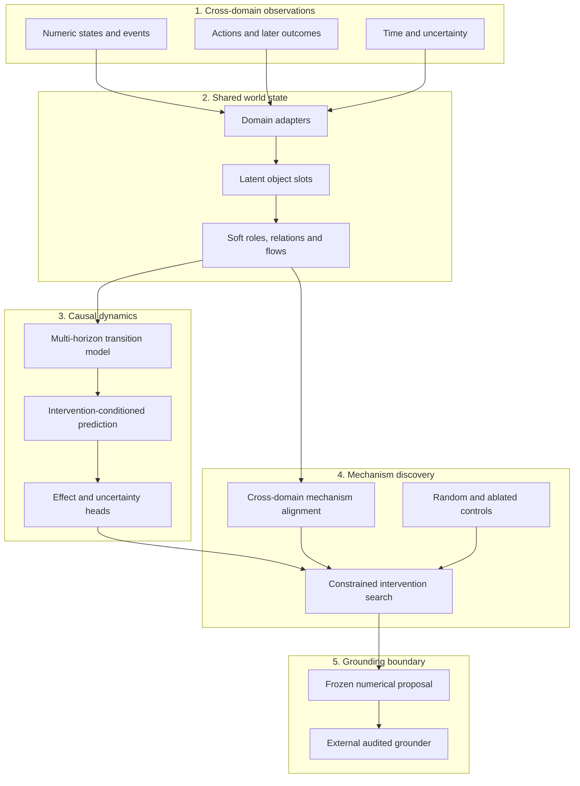

<div align="center">

# Chimera Meta-World

**Cross-domain causal world models inside Chimera Discovery Lab**

[](https://www.python.org/)
[](https://pytorch.org/)
[](https://github.com/SergiiRudniev/chimera-discovery-lab/actions/workflows/ci.yml?query=branch%3Achimera-meta-world)
[](#chimera-meta-world-w0)
[](#hardware-envelope)
[](#current-status)
[](LICENSE)

</div>

Chimera Meta-World is the causal-dynamics model family in Chimera Discovery
Lab. It is designed to learn a shared numerical representation of changing
systems, discover mechanisms across domains and propose interventions before
language grounding.

> [!IMPORTANT]
> W0 has passed a fixed-batch engineering qualification, not a model release.
> This branch contains no promoted Meta-World checkpoint and no evidence for
> causal discovery, cross-domain transfer or idea quality.

## Chimera Meta-World W0

W0 tests whether structurally related processes from different domains can be
represented in one learned state space without passing text through the model
core.

```text
Z(t) + intervention -> Z(t+1), effect, uncertainty
```

The output is a frozen numerical proposal. A separate grounder may describe or
instantiate it, but cannot modify its structure or predicted effect.

## Representation Boundary

| Inside W0 | Outside W0 |
| --- | --- |
| Numeric observations | Names and prose |
| Latent object slots | Language-model embeddings |
| Learned soft roles | Human-readable labels |
| Relations, flows and constraints | Final explanation |
| Time and interventions | Business presentation |

This boundary does not imply completely language-free thought. Dataset
selection, observation design, objectives and evaluation remain human choices.

## Architecture



The detailed boundary and qualification requirements are frozen in the
[W0 design contract](docs/META_WORLD_W0.md).

## Generated Worlds H002

H002 replaces static trajectory enumeration with seed-addressable mathematical
world generators. `FlowWorld`, `CompetitionWorld` and `FunnelWorld` share hidden
mechanisms while independent renderers change objects, channels, units, time,
noise and visibility. Model batches contain only numeric tensors; generator IDs
remain outside the model boundary.

The hypothesis, split isolation and acceptance rule were frozen before target
metrics. See the [generated-world contract](docs/WORLD_GENERATORS_H002.md).

H009 adds paired renderer views of the same hidden trajectory so representation
alignment can be tested without changing the underlying dynamics. See the
[paired generated-world contract](docs/WORLD_GENERATORS_H009.md).

H011 replaces global embedding similarity with direct agreement between the
predicted intervention-effect distributions of paired renderer views. See the
[paired response-consistency contract](docs/RESPONSE_CONSISTENCY_H011.md).

H012 freezes the complete generator-first comparison: aligned and unaligned
cross-world pretraining, target-family-only training, a temporal predictor and
legal random intervention regret. See the
[procedural pretraining contract](docs/PROCEDURAL_PRETRAINING_H012.md).

## Closed-Loop Training H003

H002 validation showed that relational state improved intervention-effect
prediction over a temporal baseline, while its in-batch alignment objective did
not beat the same relational architecture without alignment. H003 therefore
trains four autoregressive steps through model-generated states and expands the
hard-negative pool with a detached cross-batch mechanism queue.

Stable mechanism fingerprints are evaluator-only labels. They pair losses and
never enter the model forward contract. The registered test splits remain
sealed. See the [H003 training contract](docs/CLOSED_LOOP_H003.md).

## Active Identification H004

H004 replaces passive random-action pretraining with controlled numerical
system-identification probes. WG1 applies zero baselines, low/high impulses,
control polarity, reversals and recovery across generated worlds, then evaluates
every arm on the same short probe prefix followed by seeded random actions.

The action policy is evaluator metadata, not a model feature. See the
[H004 probe contract](docs/WORLD_PROBES_H004.md).

## Counterfactual Outcome Head H008

H008 tests an algebraically constrained outcome head: the model predicts
factual and no-op utility internally, then emits intervention effect as their
exact difference. Its direct-head controls have the same parameter count and
receive the same data, actions, optimizer and evaluator. See the
[H008 counterfactual-head contract](docs/COUNTERFACTUAL_HEAD_H008.md).

## Factorized Transition H013

H013 moves factual/no-op structure into state dynamics. Each procedural action
is paired with a no-op transition under the same state, external event and
renderer noise; the factorized model must reconstruct factual next state as
no-op next state plus an intervention delta. See the
[H013 factorized-transition contract](docs/FACTORIZED_TRANSITION_H013.md).

The development gate was negative: additive factorization matched but did not
beat the parameter-matched direct dual-transition model. Paired no-op
supervision did materially improve state-delta prediction versus factual-only,
so that representation signal is retained for the next registered hypothesis.

## Response-Conditioned Effect H014

H014 tests that retained signal directly. A new effect head receives either
the predicted factual-minus-no-op state response or a parameter-matched factual
residual control. WG4 integrity evidence is reused without revalidation. See the
[H014 response-conditioned contract](docs/RESPONSE_CONDITIONED_EFFECT_H014.md).

The development result was negative: no-op-subtracted response conditioning
worsened effect and rollout versus the matched factual-residual control. Paired
no-op supervision remains an auxiliary dynamics signal; the next program stage
moves from head arithmetic to equal-budget numerical intervention search.

## Numerical Intervention Search H015

H015 is the first candidate-generation gate. Chimera searches legal numerical
source/target/magnitude/control vectors with uncertainty-aware
quality-diversity, then the procedural simulator measures realized regret under
the same execution budget as random and mean-only controls. See the
[H015 intervention-search contract](docs/INTERVENTION_SEARCH_H015.md).

The development gate was negative: uncertainty-aware regret was `0.969786x`
legal random and `1.056837x` mean-only search. Exact budgets, legality, replay
and leakage guards passed, but pointwise effect predictions did not rank actions
within a state. The next hypothesis replaces the pointwise search critic with
multi-action ranking supervision from generated worlds.

## Numerical Output

```text
source_state
intervention_code
affected_slot_ids
intervention_parameters
predicted_next_state
predicted_effect
epistemic_uncertainty
structural_novelty
```

Interpretation is allowed only after deterministic replay succeeds and the
intervention is complete. Rendered outputs must round-trip to this frozen
proposal.

## Research Controls

The first evidence-bearing W0 comparison must include:

- W0 interventions;
- legal random interventions;
- an ablated dynamics model;
- a matched language baseline;
- structural metrics before grounding;
- blind quality metrics after grounding.

The same frozen grounder is used for every structural arm. If it adds a
mechanism, that mechanism is attributed to the grounder rather than W0.

## Git and Artifact Registry

| Item | Reserved form |
| --- | --- |
| Family branch | `chimera-meta-world` |
| Feature branches | `agent/meta-world-*` |
| Hypotheses | `CHM-W-H###` |
| Trials | `CHM-W-T###` |
| Corpora | `CHM-W-C###` |
| Configs | `configs/meta_world/` |
| Checkpoints | `chimera-meta-world-w0-step######.pt` |
| Release tag | `meta-world-w0` after qualification only |

Model-family branches are protected against deletion and force pushes. Changes
arrive through linear, squash-merged pull requests with both Python CI jobs.

## Hardware Envelope

The current relational W0 candidate contains **65,213,950 trainable parameters**
for local mixed-precision
training on an NVIDIA GeForce RTX 5070 with 12,227 MiB VRAM. Gradient
accumulation and activation checkpointing remain available if the final temporal
context exceeds the initial memory budget.

## Current Status

| Item | Status |
| --- | --- |
| Family name and namespace | Registered |
| Protected family branch | Active |
| W0 design contract | Registered |
| Numerical output boundary | Registered |
| Architecture implementation | Implemented |
| BF16 CUDA engineering gate | Accepted: H001/T001 |
| Generated-world corpus | Implemented and validated |
| H002 | Validation preflight negative; test sealed; result `not_run` |
| H003 | Exploratory validation negative; test sealed; result `not_run` |
| H004 | Preregistered; WG1 implemented and validated |
| H008 | Development negative; 3.2% effect gain below 10% gate; test sealed |
| W0 configuration | `meta_world_w0_t1.yaml` |
| Promoted checkpoint | None |
| Empirical claims | None |

## Repository Scope

This family branch inherits shared Chimera Discovery Lab infrastructure. The
existing Venture graph model remains visible for reproducibility but is not the
Meta-World W0 implementation. W0 code will use its own modules, configurations,
datasets and research identifiers.

## Validation

```powershell
.\.venv\Scripts\python.exe -m ruff check .
.\.venv\Scripts\python.exe -m mypy src
.\.venv\Scripts\python.exe -m pytest
.\.venv\Scripts\python.exe -m chimera.cli validate-research
```

## Documentation

- [Meta-World W0 design contract](docs/META_WORLD_W0.md)
- [Generated Worlds H002](docs/WORLD_GENERATORS_H002.md)
- [Paired Generated Worlds H009](docs/WORLD_GENERATORS_H009.md)
- [Shared Mechanism Bottleneck H010](docs/SHARED_BOTTLENECK_H010.md)
- [Closed-Loop Training H003](docs/CLOSED_LOOP_H003.md)
- [System-Identification Probes H004](docs/WORLD_PROBES_H004.md)
- [Counterfactual Outcome Head H008](docs/COUNTERFACTUAL_HEAD_H008.md)
- [Model registry](docs/MODEL_REGISTRY.md)
- [Repository governance](docs/GOVERNANCE.md)
- [Research protocol](docs/RESEARCH_PROTOCOL.md)
- [Research journal](docs/RESEARCH_JOURNAL.md)
- [GPU setup](docs/GPU_SETUP.md)

## License

Apache License 2.0. See [LICENSE](LICENSE).
