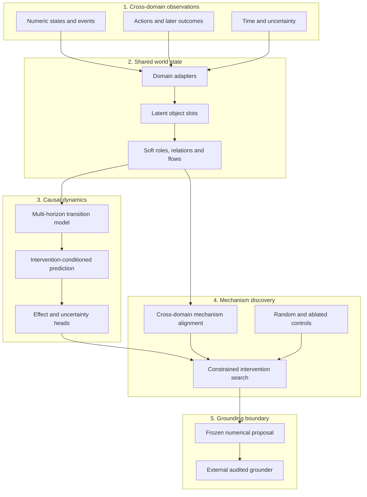

<div align="center">

# Chimera Meta-World

**Cross-domain causal world models inside Chimera Discovery Lab**

[](https://www.python.org/)
[](https://pytorch.org/)
[](https://github.com/SergiiRudniev/chimera-discovery-lab/actions/workflows/ci.yml?query=branch%3Achimera-meta-world)
[](#chimera-meta-world-w0)
[](#hardware-envelope)
[](#current-status)
[](LICENSE)

</div>

Chimera Meta-World is the causal-dynamics model family in Chimera Discovery
Lab. It is designed to learn a shared numerical representation of changing
systems, discover mechanisms across domains and propose interventions before
language grounding.

> [!IMPORTANT]
> W0 is a registered architecture, not a trained model release. This branch
> contains no Meta-World checkpoint and no empirical evidence for causal
> discovery, cross-domain transfer or idea quality.

## Chimera Meta-World W0

W0 tests whether structurally related processes from different domains can be
represented in one learned state space without passing text through the model
core.

```text
Z(t) + intervention -> Z(t+1), effect, uncertainty
```

The output is a frozen numerical proposal. A separate grounder may describe or
instantiate it, but cannot modify its structure or predicted effect.

## Representation Boundary

| Inside W0 | Outside W0 |
| --- | --- |
| Numeric observations | Names and prose |
| Latent object slots | Language-model embeddings |
| Learned soft roles | Human-readable labels |
| Relations, flows and constraints | Final explanation |
| Time and interventions | Business presentation |

This boundary does not imply completely language-free thought. Dataset
selection, observation design, objectives and evaluation remain human choices.

## Architecture



The detailed boundary and qualification requirements are frozen in the
[W0 design contract](docs/META_WORLD_W0.md).

## Numerical Output

```text
source_state
intervention_code
affected_slot_ids
intervention_parameters
predicted_next_state
predicted_effect
epistemic_uncertainty
structural_novelty
```

Interpretation is allowed only after deterministic replay succeeds and the
intervention is complete. Rendered outputs must round-trip to this frozen
proposal.

## Research Controls

The first evidence-bearing W0 comparison must include:

- W0 interventions;
- legal random interventions;
- an ablated dynamics model;
- a matched language baseline;
- structural metrics before grounding;
- blind quality metrics after grounding.

The same frozen grounder is used for every structural arm. If it adds a
mechanism, that mechanism is attributed to the grounder rather than W0.

## Git and Artifact Registry

| Item | Reserved form |
| --- | --- |
| Family branch | `chimera-meta-world` |
| Feature branches | `agent/meta-world-*` |
| Hypotheses | `CHM-W-H###` |
| Trials | `CHM-W-T###` |
| Corpora | `CHM-W-C###` |
| Configs | `configs/meta_world/` |
| Checkpoints | `chimera-meta-world-w0-step######.pt` |
| Release tag | `meta-world-w0` after qualification only |

Model-family branches are protected against deletion and force pushes. Changes
arrive through linear, squash-merged pull requests with both Python CI jobs.

## Hardware Envelope

W0 targets approximately **64M trainable parameters** for local mixed-precision
training on an NVIDIA GeForce RTX 5070 with 12,227 MiB VRAM. Gradient
accumulation and activation checkpointing remain available if the final temporal
context exceeds the initial memory budget.

The exact parameter count is not published until the executable W0
configuration exists and `chimera inspect` can derive it from code.

## Current Status

| Item | Status |
| --- | --- |
| Family name and namespace | Registered |
| Protected family branch | Active |
| W0 design contract | Registered |
| Numerical output boundary | Registered |
| Architecture implementation | Not started |
| First cross-domain corpus | Not built |
| W0 configuration | Not created |
| Trained checkpoint | None |
| Empirical claims | None |

## Repository Scope

This family branch inherits shared Chimera Discovery Lab infrastructure. The
existing Venture graph model remains visible for reproducibility but is not the
Meta-World W0 implementation. W0 code will use its own modules, configurations,
datasets and research identifiers.

## Validation

```powershell
.\.venv\Scripts\python.exe -m ruff check .
.\.venv\Scripts\python.exe -m mypy src
.\.venv\Scripts\python.exe -m pytest
.\.venv\Scripts\python.exe -m chimera.cli validate-research
```

## Documentation

- [Meta-World W0 design contract](docs/META_WORLD_W0.md)
- [Model registry](docs/MODEL_REGISTRY.md)
- [Repository governance](docs/GOVERNANCE.md)
- [Research protocol](docs/RESEARCH_PROTOCOL.md)
- [Research journal](docs/RESEARCH_JOURNAL.md)
- [GPU setup](docs/GPU_SETUP.md)

## License

Apache License 2.0. See [LICENSE](LICENSE).
