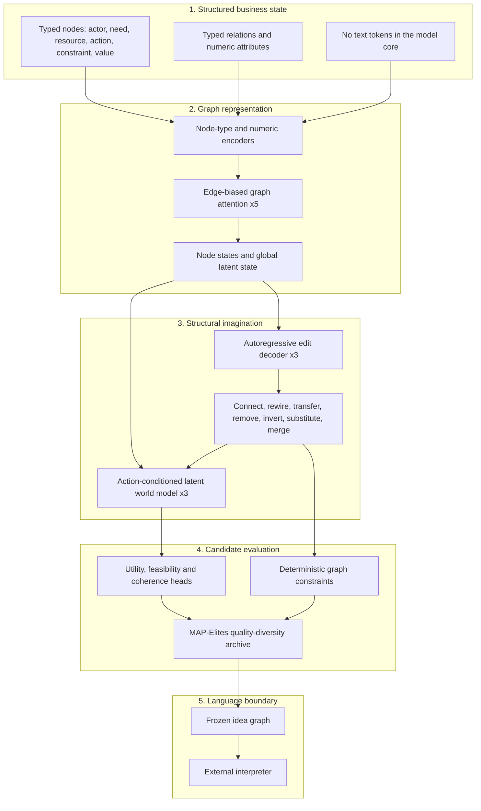

<div align="center">

# Chimera Venture

**Non-linguistic business ideation models inside Chimera Discovery Lab**

[](https://www.python.org/)
[](https://pytorch.org/)
[](https://github.com/SergiiRudniev/chimera-discovery-lab/actions/workflows/ci.yml)
[](#venture-m0)
[](#venture-m0)
[](#venture-corpus-c1)
[](#current-status)
[](LICENSE)

</div>

Chimera Venture is the first model family in Chimera Discovery Lab. It generates
typed graph-edit programs over actors, needs, resources, actions, constraints,
channels, value flows and outcomes. Natural language is excluded from the model
core and introduced only after a candidate structure has been frozen.

> [!IMPORTANT]
> This repository contains an architecture and engineering qualifications.
> Venture Trial T2 restored structured proposal diversity, but it does not
> provide evidence that non-linguistic generation is more novel or useful than
> a language baseline.

## Reserved Model Families

| Family | Specialization | Branch | Research IDs |
| --- | --- | --- | --- |
| **Chimera Venture** | Business models and commercial hypotheses | `chimera-venture` | `CHM-V-H###` |
| **Chimera Catalyst** | Product and growth mechanisms | `chimera-catalyst` | `CHM-C-H###` |
| **Chimera Oracle** | Scientific hypotheses | `chimera-oracle` | `CHM-O-H###` |
| **Chimera Architect** | Systems and engineering concepts | `chimera-architect` | `CHM-A-H###` |
| **Chimera Nexus** | Cross-domain transfer | `chimera-nexus` | `CHM-N-H###` |
| **Chimera Frontier** | Open-ended experimental search | `chimera-frontier` | `CHM-F-H###` |

Names, branch namespaces and experiment prefixes are reserved in the
[model registry](docs/MODEL_REGISTRY.md).

## Complete Architecture



## Venture M0

The registered M0 configuration contains **20,647,992 trainable parameters**
and uses a 384-dimensional graph state, five
relation-aware encoder blocks, three edit-decoder blocks and three latent
transition blocks. It accepts up to 64 nodes and emits up to eight structural
edits per candidate.

| Component | M0 contract |
| --- | --- |
| Input | Typed graph plus eight numeric features per node |
| Context | Maximum 64 nodes, 16 relation types |
| Generator | Nine edit operations, maximum eight steps |
| World model | EMA-target joint-embedding prediction |
| Scores | Utility, feasibility and structural coherence |
| Diversity | External MAP-Elites archive |
| Language | Forbidden in the core; external interpretation only |

The core returns a structure, not a sentence:

```text
operation: TRANSFER_ROLE
source_node: 07
target_node: 12
node_type: RESOURCE
edge_type: ENABLES
predicted_delta: [utility, feasibility, coherence]
```

## Training Objective

```text
minimize  edit-program reconstruction
        + operation-conditioned argument and pointer loss
        + next-state latent prediction
        + utility / feasibility / coherence calibration
        - bounded operation entropy
```

Novelty is not optimized as an unconstrained scalar. Candidates compete within
behavioral niches, and feasibility remains a guardrail. The first real test is
a preregistered comparison against a matched text baseline.

## Venture Corpus C0

Corpus C0 contains **10 source-grounded business graphs** and **640 deterministic
denoising transitions** built from public SEC filings. Company-level isolation
produces 384 training, 128 validation and 128 test transitions.

The model-ready NPZ shards contain categorical IDs, masks and normalized numeric
features only. Company names, node labels, evidence notes and source URLs remain
in sidecars that are never passed to the model.

- [Numeric and graph semantics](docs/BUSINESS_GRAPH_SEMANTICS.md)
- [Dataset card](datasets/venture_corpus_c0/README.md)
- [Dataset manifest](datasets/venture_corpus_c0/manifest.json)
- [Data-quality profile](datasets/venture_corpus_c0/quality_report.json)

## Venture Corpus C1

Corpus C1 freezes the evidence-bearing inputs for `CHM-V-H001`: **2 calibration
cases and 8 evaluation cases** from FY2025 SEC filings. Its organizations, CIKs
and accessions have zero overlap with C0, and its earliest period end is later
than every C0 period end.

The Chimera arm receives `graphs.npz`: node types, relation types, eight numeric
features and numeric objective/constraint masks. The archive contains no text or
object arrays. The matched text baseline receives a deterministic rendering of
the same registered graph and challenge.

- [Dataset card](datasets/venture_corpus_c1/README.md)
- [Dataset manifest](datasets/venture_corpus_c1/manifest.json)
- [Matched baseline protocol](datasets/venture_corpus_c1/matched_baseline_protocol.yaml)
- [Blind rating protocol](datasets/venture_corpus_c1/rating_protocol.yaml)
- [Independent review protocol](datasets/venture_corpus_c1/review_protocol.yaml)
- [Reviewer packet](datasets/venture_corpus_c1/reviewer_packet.json)
- [AI-assisted review ledger](datasets/venture_corpus_c1/ai_reviews/multi_lens_ai_review.json)
- [Executed quality notebook](notebooks/venture_corpus_c1_quality.ipynb)

C1 is provisional. An internal primary-source audit covers 10/10 cases, but the
independent review gate remains blocked at 0/1 accepted reviews. The v2 review
packet requires decisions on 32 evidence notes, 126 nodes, 882 human-assigned
ratings, 100 edges and every objective/constraint reference. Candidate generation
cannot start until a second reviewer closes `C1-Q001`.

## Venture Trial T0

The first frozen end-to-end trial trained M0 for 300 steps on Corpus C0 and
selected checkpoint step 175 by validation loss. Four engineering checks passed,
but train exact-graph reconstruction was 0% against the preregistered 95%
threshold. The result is `completed_with_gaps`, not an accepted model release.

Validity-constrained sampling produced 160 valid changed candidates and 148
unique resulting graphs. The observed operation set remained limited to the
three edit families supervised by Corpus C0.

- [Trial report](research/trials/CHM-V-T000/README.md)
- [Machine-readable result](research/trials/CHM-V-T000/result.json)
- [Checkpoint manifest](research/trials/CHM-V-T000/checkpoint_manifest.json)

## Venture Trial T1

The corrective T1 trial masked arguments unused by each edit operation, trained
for 3,000 CUDA steps and selected checkpoint step 2700 by validation exact-graph
rate. It passed the registered engineering checks with 99.22% train exact-graph
reconstruction, 30.47% validation reconstruction and 14.84% test reconstruction.

T1 also exposed a trade-off: all generated programs were valid, but unique-graph
rate fell from 92.50% in T0 to 33.13% in T1. The checkpoint qualifies structural
learning only; generation diversity still requires correction.

- [Trial report](research/trials/CHM-V-T001/README.md)
- [Machine-readable result](research/trials/CHM-V-T001/result.json)
- [Checkpoint manifest](research/trials/CHM-V-T001/checkpoint_manifest.json)

## Venture Trial T2

T2 separated exploratory proposal sampling from reconstruction without changing
the T1 checkpoint. Validation selected `explore-50`; on test it produced 94.01%
mean unique graphs versus 27.08% for `model-only`, with 100% changed candidates,
0% invalid programs and all eight non-terminal operations. Train exact-graph
reconstruction remained 99.22%.

T2 publishes a small policy bundle bound to the T1 checkpoint SHA-256, not a new
set of model weights.

- [Trial report](research/trials/CHM-V-T002/README.md)
- [Machine-readable result](research/trials/CHM-V-T002/result.json)
- [Policy manifest](research/trials/CHM-V-T002/policy_manifest.json)

## Research Ledger

Every experiment receives an immutable family-specific ID:

```text
CHM-V-H000, CHM-V-H001, CHM-V-H002, ...
```

Each record links its frozen hypothesis, configuration, data boundary, result,
decision and next action. Missing results remain `not_run`; no metrics are
reconstructed from memory.

- [Research journal](docs/RESEARCH_JOURNAL.md)
- [Machine-readable registry](research/registry.yaml)
- [Research protocol](docs/RESEARCH_PROTOCOL.md)

## Current Status

| Item | Status |
| --- | --- |
| Venture architecture | Implemented |
| Structured tensor contracts | Implemented |
| Autoregressive graph-edit generator | Implemented |
| EMA latent-world objective | Implemented |
| MAP-Elites archive | Implemented |
| Synthetic engineering validation | Passed: loss 7.1843 → 1.0263 in 20 fixed-batch steps |
| Venture Corpus C0 | 10 graphs; 640 source-isolated denoising transitions |
| Venture Corpus C1 | 2 calibration + 8 evaluation graphs; preregistered |
| C0/C1 source overlap | 0 organizations, 0 CIKs, 0 accessions |
| Corpus C0 training smoke | Passed: loss 7.3673 -> 1.1501 in 5 fixed-batch steps |
| Venture Trial T0 | Completed with gaps; exact reconstruction criterion failed |
| Venture Trial T1 | Passed structural reconstruction qualification |
| Venture Trial T2 | Passed exploratory proposal-policy qualification |
| Trained checkpoint | T1 step 2700 engineering prerelease |
| Proposal policy | T2 `explore-50`; T1 weights unchanged |
| H001 protocol | Frozen; generation blocked pending independent C1 review |
| Creativity claim | Not evaluated |

## Setup

```powershell
git clone https://github.com/SergiiRudniev/chimera-discovery-lab.git
cd chimera-discovery-lab

python -m venv .venv
.\.venv\Scripts\Activate.ps1
python -m pip install --upgrade pip
python -m pip install -e ".[dev]"
```

RTX 50-series setup is documented in [GPU setup](docs/GPU_SETUP.md). The T0
environment used PyTorch 2.13.0 with CUDA 13.2 and verified `sm_120` execution.

Inspect the registered model:

```powershell
chimera inspect --config configs/venture/venture_m0_20m.yaml
```

Run the deterministic engineering smoke test:

```powershell
chimera smoke --config configs/venture/venture_smoke.yaml --steps 20
```

Rebuild and validate Corpus C0:

```powershell
chimera build-corpus
chimera validate-corpus
chimera corpus-smoke --steps 5 --batch-size 2
chimera venture-trial
chimera venture-trial --config configs/venture/venture_trial_t1.yaml `
  --output research/trials/CHM-V-T001 `
  --checkpoint-dir checkpoints/venture_m0_t1
chimera proposal-diagnostic
chimera proposal-trial
```

## Validation

```powershell
ruff check .
mypy src
pytest
chimera validate-corpus
chimera validate-research
```

GitHub Actions runs lint, type checks, tests and the research-ledger validator
on every pull request and protected model-family branch.

## Documentation

- [Architecture](docs/ARCHITECTURE.md)
- [Data contract](docs/DATA_CONTRACT.md)
- [Business graph semantics](docs/BUSINESS_GRAPH_SEMANTICS.md)
- [Model registry](docs/MODEL_REGISTRY.md)
- [Repository governance](docs/GOVERNANCE.md)
- [Research protocol](docs/RESEARCH_PROTOCOL.md)
- [Reproducibility](docs/REPRODUCIBILITY.md)
- [GPU setup](docs/GPU_SETUP.md)

## License

Apache License 2.0. See [LICENSE](LICENSE).
