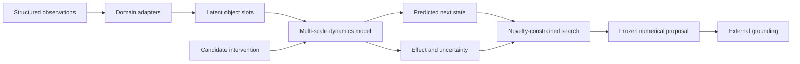

# Chimera Meta-World W0

## Registration

| Field | Value |
| --- | --- |
| Family | Chimera Meta-World |
| First generation | Chimera Meta-World W0 |
| Family branch | `chimera-meta-world` |
| Research prefix | `CHM-W` |
| Config namespace | `configs/meta_world/` |
| Registered size | 61,854,120 trainable parameters |
| Local hardware | NVIDIA GeForce RTX 5070, 12,227 MiB VRAM |
| Status | Core implemented; H001 engineering qualification accepted |

W0 is a bounded research model, not a claim to general world understanding. Its
first purpose is to test whether one numerical dynamics representation can
recover and transfer useful mechanisms across structurally related domains.

## Core Boundary

The W0 core receives numeric observations, topology, time and intervention
signals. It does not receive names, prose, token IDs or language-model
embeddings. Human-readable metadata remains in sidecars outside training and
inference.

Language may describe a frozen W0 result only after generation. The language
layer cannot add, remove or alter an intervention, predicted effect or
uncertainty value.

This boundary tests a narrower claim than language-free thought. Dataset
selection, sensors, objectives and evaluation rules still encode human choices.

## World State

W0 represents a changing system as latent object slots, soft learned roles,
directed interactions, conserved or scarce quantities, constraints and time.
Roles are continuous learned vectors rather than a fixed list of business nouns.

```text
Z(t) = slots + relations + flows + constraints + global state
I(t) = intervention operation + affected slots + numeric change
Z(t+1), effect, uncertainty = dynamics(Z(t), I(t))
```

Domain adapters map compatible structured sources into this shared state. The
first dataset must include actions and later outcomes; static descriptions alone
cannot qualify causal dynamics.

## Architecture Contract



The implementation must keep five responsibilities separable:

1. domain-specific observation adapters;
2. shared latent state construction;
3. action-conditioned temporal dynamics;
4. constrained intervention search;
5. external, auditable grounding.

## Output Contract

W0 returns a numerical proposal rather than a sentence:

```text
source_state
intervention_code
affected_slot_ids
intervention_parameters
predicted_next_state
predicted_effect
epistemic_uncertainty
structural_novelty
```

A proposal is not eligible for interpretation unless the intervention is
complete, deterministic replay succeeds and the predicted effect includes an
uncertainty estimate.

## Initial Training Objectives

The W0 qualification design may combine:

- masked state and relation reconstruction;
- next-state prediction over multiple horizons;
- inverse intervention identification;
- counterfactual consistency;
- cross-domain mechanism alignment;
- variance and covariance regularization against latent collapse.

Every term, dataset split and decision threshold must be preregistered under a
`CHM-W-H###` record before target results are opened.

## Grounding Audit

The same frozen grounding system must render W0 proposals and legal random
controls. A rendered result must round-trip to the original numerical proposal.
Any added mechanism is attributed to the grounder, not W0.

The first evidence-bearing comparison must include at least:

- W0 interventions;
- legal random interventions;
- an ablated dynamics model;
- a matched language baseline;
- raw structural metrics before grounding;
- blind quality metrics after grounding.

## Artifact Names

```text
configs/meta_world/meta_world_w0.yaml
research/hypotheses/CHM-W-H000.yaml
research/results/CHM-W-H000.json
research/trials/CHM-W-T000/
datasets/meta_world_corpus_c0/
chimera-meta-world-w0-step######.pt
```

The executable corrective configuration is
`configs/meta_world/meta_world_w0_t1.yaml`. H001 qualifies CUDA execution and
fixed-batch optimization only. No W0 checkpoint is promoted until held-out
dynamics, calibration and transfer protocols pass.

`CHM-W-C000` contains 163,840 deterministic procedural trajectories. Its
automated quality gate has passed; independent AI review remains required before
the corpus may be used by H002.
